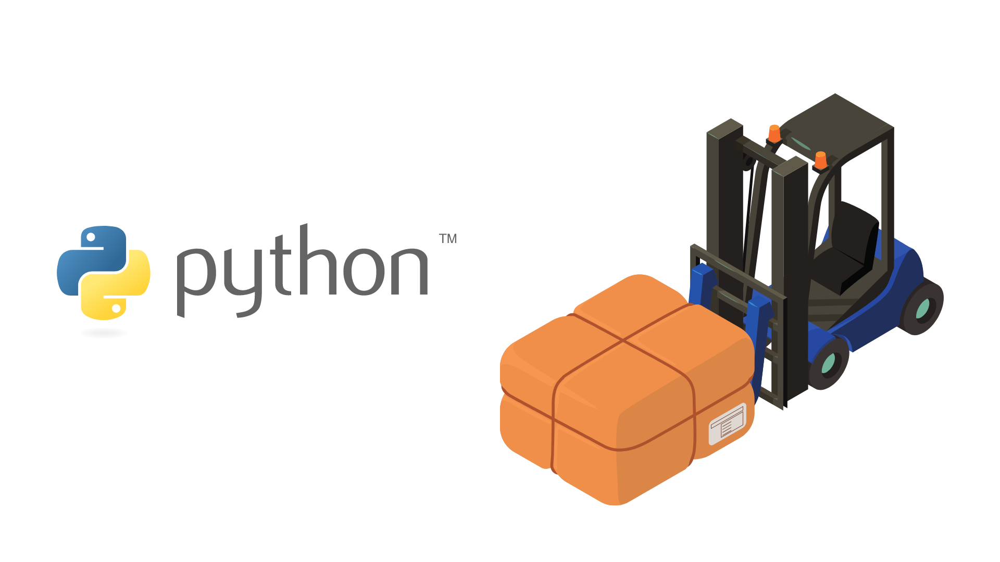
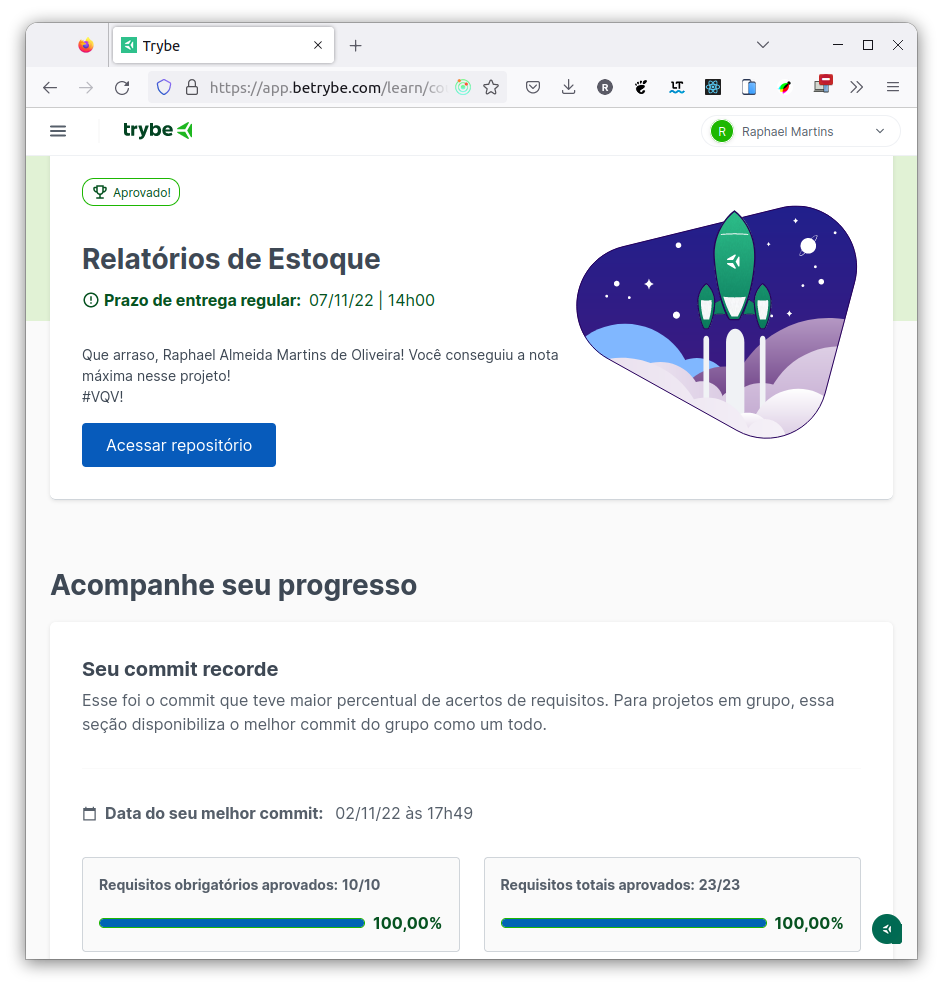

# :snake: Python Inventory Report :package:

## :page_with_curl: About/Sobre

  
<strong>:us: English</strong>
 

Python data science project developed by [Raphael Martins](https://www.linkedin.com/in/raphaelameidamartins/) at the end of Unit 34 ([Computer Science Module](https://github.com/raphaelalmeidamartins/trybe_exercicios/tree/main/4_Ciencia-da-Computa%C3%A7%C3%A3o)) of Trybe's Web Development course. I was approved with 100% of the mandatory and optional requirements met.

We had to develop an inventory report generator using Object-Oriented Programming (OOP) and test eveything with the Pytest library. You can generate reports by importing files in XML, CSV and JSON formats.
 

  
<strong>:brazil: Português</strong>
 

Projeto de Python e ciência de dados desenvolvido por [Raphael Martins](https://www.linkedin.com/in/raphaelameidamartins/) ao final do Bloco 34 ([Módulo Ciência da Computação](https://github.com/raphaelalmeidamartins/trybe_exercicios/tree/main/4_Ciencia-da-Computa%C3%A7%C3%A3o)) do curso de Desenvolvimento Web da Trybe. Fui aprovado com 100% dos requisitos obrigatórios e opcionais atingidos.

Tivemos que desenvolver um gerador de relatórios de estoque utilizando Programação Orientada a Objetos (POO) e aplicando testes com a biblioteca Pytest. É possível gerar relatórios importando arquivos nos formatos XML, CSV e JSON.
 

## :man_technologist: Developed Skills/Habilidades Desenvolvidas

  
<strong>:us: English</strong>
 

* Use Object-Oriented Programming (OPP) with Python
* Use design patterns
* Read and write files (XML, CSV, JSON)
 

  
<strong>:brazil: Português</strong>
 

* Aplicar conceitos de Programação Orientada a Objetos (POO) em Python
* Aplicar padrões de projeto (design patterns)
* Leitura e escrita de arquivos (XML, CSV, JSON)

 

## :hammer_and_wrench: Tools/Ferramentas

* Python
* Pytest

## :trophy: Grade/Nota

